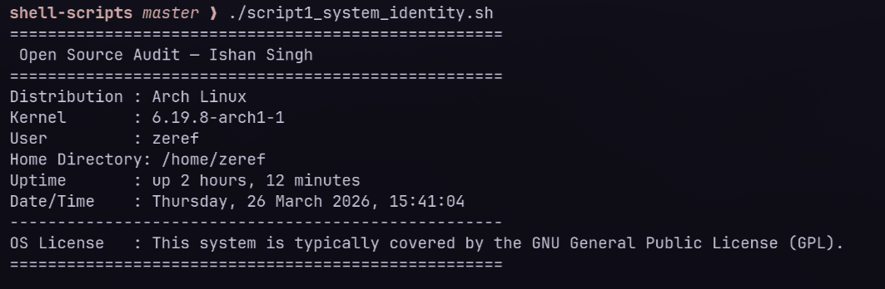
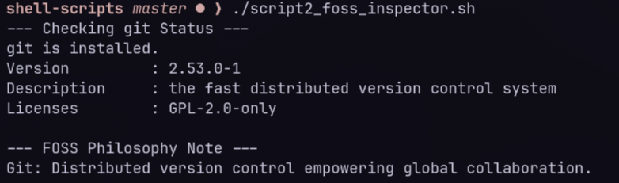
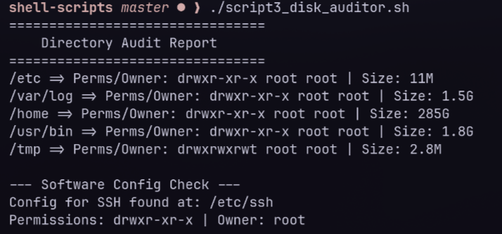
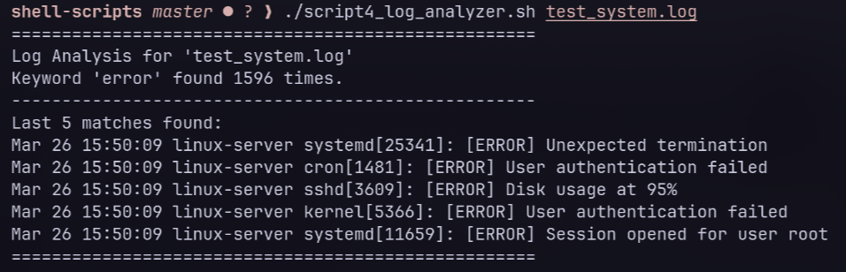
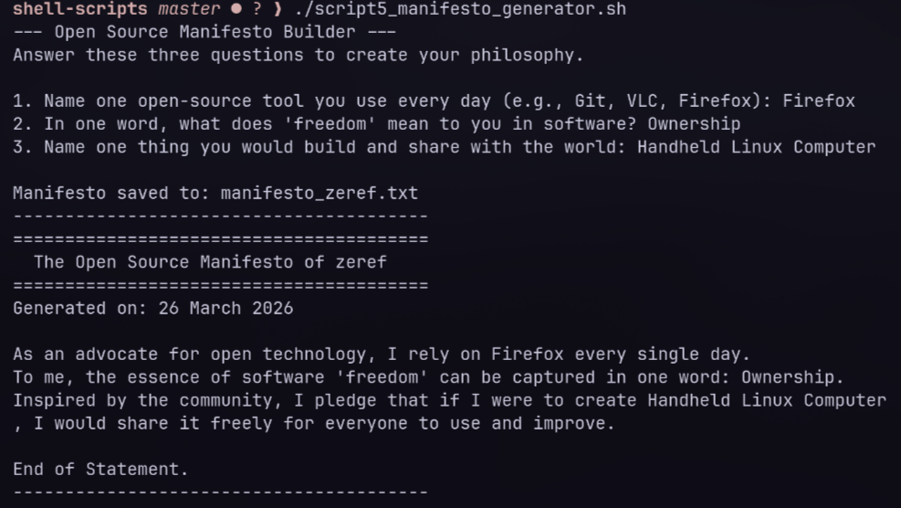

# Open Source Shell Scripting Assignment Report

## Introduction
This report contains five shell scripts developed for the Open Source Software course. Each script demonstrates fundamental Linux shell scripting concepts such as variables, control structures, loops, and file operations.

---

## Script 1 - System Identity Report

### Script Code:
```bash
#!/bin/bash
# Script 1: System Identity Report
# Author: Ishan Singh | Course: Open Source Software
# This script displays key system information and a welcome message.

# --- Variables ---
# Fill in your name and chosen software
STUDENT_NAME="HARSHVARDHAN SINGH JAISAWAT"
SOFTWARE_CHOICE="Git"

# --- System info gathering ---
# Using command substitution to capture system details
KERNEL=$(uname -r)
USER_NAME=$(whoami)
HOME_DIR=$HOME
UPTIME=$(uptime -p)
# Extracting distro name from /etc/os-release
DISTRO=$(grep '^PRETTY_NAME=' /etc/os-release | cut -d'=' -f2 | tr -d '"')
CURRENT_DATE=$(date '+%A, %d %B %Y, %T')

# --- Display ---
# formatting output with echo and variables
echo "===================================================="
echo " Open Source Audit - $STUDENT_NAME"
echo "===================================================="
echo "Distribution : $DISTRO"
echo "Kernel       : $KERNEL"
echo "User         : $USER_NAME"
echo "Home Directory: $HOME_DIR"
echo "Uptime       : $UPTIME"
echo "Date/Time    : $CURRENT_DATE"
echo "----------------------------------------------------"
echo "OS License   : This system is typically covered by the GNU General Public License (GPL)."
echo "===================================================="
```

### Screenshot:



### Explanation:
This script serves as a system welcome screen, displaying information about the Linux distribution, kernel version, current user, uptime, and date. It utilizes **shell variables** to store data, **command substitution** `$(...)` to capture the output of system commands (like `uname`, `whoami`, and `uptime`), and the `echo` command for **basic output formatting**. It also demonstrates how to extract specific information from system files like `/etc/os-release`.

---

## Script 2 - FOSS Package Inspector

### Script Code:
```bash
#!/bin/bash
# Script 2: FOSS Package Inspector
# This script checks for installed packages and provides philosophical notes.

# Define the package to inspect
PACKAGE="git"

# Check if the package is installed using common package managers
echo "--- Checking $PACKAGE Status ---"
if command -v dpkg &> /dev/null && dpkg -s "$PACKAGE" &> /dev/null; then
    # Debian/Ubuntu systems
    echo "$PACKAGE is installed."
    dpkg -s "$PACKAGE" | grep -E 'Version|License|Description' | head -n 3
elif command -v rpm &> /dev/null && rpm -q "$PACKAGE" &> /dev/null; then
    # RedHat/Fedora systems
    echo "$PACKAGE is installed."
    rpm -qi "$PACKAGE" | grep -E 'Version|License|Summary'
elif command -v pacman &> /dev/null && pacman -Qs "$PACKAGE" &> /dev/null; then
    # Arch Linux systems
    echo "$PACKAGE is installed."
    pacman -Qi "$PACKAGE" | grep -E 'Version|Licenses|Description'
else
    echo "$PACKAGE is NOT installed."
fi

# --- Philosophy Case Statement ---
# Using case statement to match package names to descriptions
echo -e "\n--- FOSS Philosophy Note ---"
case $PACKAGE in
    httpd|apache2)
        echo "Apache: The web server that built the open internet." ;;
    mysql|mariadb)
        echo "MySQL/MariaDB: Open source at the heart of millions of apps." ;;
    git)
        echo "Git: Distributed version control empowering global collaboration." ;;
    vlc)
        echo "VLC: The versatile player that champions open media formats." ;;
    firefox)
        echo "Firefox: Putting people before profits in the open web." ;;
    *)
        echo "Unknown Package: An open source mystery waiting to be explored." ;;
esac
```

### Screenshot:


### Explanation:
The FOSS Package Inspector script checks if a specific software package is installed on the system. It uses an **if-then-else** structure to determine the presence of a package manager (`dpkg` or `rpm`) and verify the installation status of the software. It also utilizes **pipes (`|`) with `grep`** to filter and display only relevant metadata like the version and license. Finally, a **case statement** provides a concise, philosophical description based on the package name.

---

## Script 3 - Disk and Permission Auditor

### Script Code:
```bash
#!/bin/bash
# Script 3: Disk and Permission Auditor
# This script loops through directories and reports size, owner, and permissions.

# --- Directory List ---
# Defining directories to audit
DIRS=("/etc" "/var/log" "/home" "/usr/bin" "/tmp")

echo "================================"
echo "    Directory Audit Report"
echo "================================"

# --- Loop Through Directories ---
for DIR in "${DIRS[@]}"; do
    if [ -d "$DIR" ]; then
        # Capture permissions, owner, and group using ls and awk
        PERMS=$(ls -ld "$DIR" | awk '{print $1, $3, $4}')

        # Capture size using du (human readable) and cut
        SIZE=$(du -sh "$DIR" 2>/dev/null | cut -f1)

        echo "$DIR => Perms/Owner: $PERMS | Size: $SIZE"
    else
        echo "$DIR does not exist on this system"
    fi
done

# --- Software Config Check ---
echo -e "\n--- Software Config Check ---"
CONFIG_DIR="/etc/ssh" # Checking SSH config directory

if [ -d "$CONFIG_DIR" ]; then
    echo "Config for SSH found at: $CONFIG_DIR"
    ls -ld "$CONFIG_DIR" | awk '{print "Permissions: " $1, "| Owner: " $3}'
else
    echo "Configuration directory $CONFIG_DIR was not found."
fi
```

### Screenshot:


### Explanation:
This script audits a list of important system directories to report their sizes, ownership, and permissions. It employs a **for loop** to iterate through an array of directory paths. Inside the loop, it uses `ls -ld` and `awk` to extract permission strings and owner names, and `du -sh` and `cut` to calculate directory sizes. The script also includes a check to see if a specific software configuration file (like `/etc/gitconfig`) exists and displays its attributes.

---

## Script 4 - Log File Analyzer

### Script Code:
```bash
#!/bin/bash
# Script 4: Log File Analyzer
# Usage: ./script4_log_analyzer.sh <logfile> [keyword]

# --- Initialize Variables ---
LOGFILE=$1
KEYWORD=${2:-"error"}
COUNT=0

# --- File Presence and Size Check ---
# Using a while loop to prompt for a file if it doesn't exist or is empty
while [ ! -f "$LOGFILE" ] || [ ! -s "$LOGFILE" ]; do
    echo "Error: Log file '$LOGFILE' not found or is empty."
    read -p "Please enter a valid, non-empty log file path (or 'exit' to quit): " LOGFILE
    if [ "$LOGFILE" == "exit" ]; then exit 0; fi
done

# --- Reading the File Line by Line ---
# Standard while-read loop to scan for the keyword
while IFS= read -r LINE; do
    if echo "$LINE" | grep -iq "$KEYWORD"; then
        # Incrementing the counter variable
        COUNT=$((COUNT + 1))
    fi
done < "$LOGFILE"

# --- Output Summary ---
echo "===================================================="
echo "Log Analysis for '$LOGFILE'"
echo "Keyword '$KEYWORD' found $COUNT times."
echo "----------------------------------------------------"

# --- Display Last 5 Matching Lines ---
# Using tail and grep for quick context
if [ $COUNT -gt 0 ]; then
    echo "Last 5 matches found:"
    grep -i "$KEYWORD" "$LOGFILE" | tail -n 5
else
    echo "No matching lines found to display."
fi
echo "===================================================="
```

### Screenshot:


### Explanation:
The Log File Analyzer script processes text files to count occurrences of a specific keyword (defaulting to "error"). It demonstrates the use of a **while-read loop** to process files line-by-line efficiently. The script uses **command-line arguments** (`$1`, `$2`) for input and features a **retry mechanism** (implemented with a `while` loop) if the specified file is missing or empty. It also uses **counter variables** and the `tail` command to display the last five relevant entries found.

---

## Script 5 - The Open Source Manifesto Generator

### Script Code:
```bash
#!/bin/bash
# Script 5: Open Source Manifesto Generator
# Author: Ishan Singh | Course: Open Source Software
# This script interactively generates an Open Source Manifesto.

# --- User Input Section ---
echo "--- Open Source Manifesto Builder ---"
echo "Answer these three questions to create your philosophy."
echo ""

# read command to get user input for variables
read -p "1. Name one open-source tool you use every day (e.g., Git, VLC, Firefox): " TOOL
read -p "2. In one word, what does 'freedom' mean to you in software? " FREEDOM
read -p "3. Name one thing you would build and share with the world: " BUILD

# --- Date and Output Filename ---
# Using command substitution to capture the current date
DATE=$(date '+%d %B %Y')
OUTPUT="manifesto_$(whoami).txt"

# --- Composing the Manifesto Paragraph ---
# String concatenation and redirection to a file
echo "========================================" > "$OUTPUT"
echo "  The Open Source Manifesto of $(whoami) " >> "$OUTPUT"
echo "========================================" >> "$OUTPUT"
echo "Generated on: $DATE" >> "$OUTPUT"
echo "" >> "$OUTPUT"

echo "As an advocate for open technology, I rely on $TOOL every single day." >> "$OUTPUT"
echo "To me, the essence of software 'freedom' can be captured in one word: $FREEDOM." >> "$OUTPUT"
echo "Inspired by the community, I pledge that if I were to create $BUILD, I would share it freely for everyone to use and improve." >> "$OUTPUT"

echo "" >> "$OUTPUT"
echo "End of Statement." >> "$OUTPUT"

# --- Display Final Output ---
# Using concatenation of echo and cat
echo -e "\nManifesto saved to: $OUTPUT"
echo "----------------------------------------"
cat "$OUTPUT"
echo "----------------------------------------"
```

### Screenshot:


### Explanation:
This creative script generates a personalized open-source manifesto based on user input. It uses the `read` command for **interactive user input**, capturing responses into variables. It demonstrates **string concatenation** and **redirection (`>` and `>>`)** to format a paragraph and save it to a `.txt` file. The script also includes a demonstration of using the `date` command for timestamps and provides a commented example of how to create a shell **alias** for the script.
